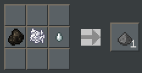
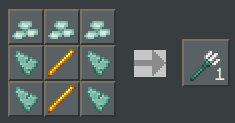

# No-Monster Datapack

A data pack for Minecrafters who like playing without monsters.

## Credits

Created by Jason C. McDonald (CodeMouse92)

Some recipes based on Craftman by TheDiamondPlayables

## Purpose

My mother enjoys playing Minecraft with me, but she's never liked dealing with hostile mobs, so we usually turn those off. The trouble is, without monsters, there are so many important items you can never get! What's more, Peaceful mode just makes things *too* easy.

This data pack fixes all that.

## Features

* This data pack provides alternative sources for all hostile mob drops. Some are craftable or smeltable, others come from non-hostile mob drops.

* Adds the "missing recipes": saddles, bells, chain mail, elytra, and so on.

* Removes hostile mobs on any difficulty level. (You can control which types of
hostile mobs spawn.)

## Recipes

### Crafting

#### Bell

Crafted with 3 sticks, 3 gold ingots, and 1 gold nugget.


#### Blaze Rod

Crafted from 2 blaze powder (see Blast Furnace), 1 slimeball, and 1 stick.


#### Chainmail

Crafted using standard armor shapes, but with iron nuggets instead of ingots.


#### Cobweb

Crafted from 4 string and 1 slimeball.


#### Elytra

Crafted from 3 sticks, 4 phantom membrane (see Blast Furnace), and 1 iron nugget.


#### Enchanted Golden Apple

Crafted from 8 gold blocks and 1 golden apple.


#### Globe Banner Pattern

Crafted from 1 paper and 1 diamond.


(Originally from Craftman by TheDiamondPlayables)

#### Gunpowder

Crafted from 1 coal or charcoal, 1 bonemeal, and 1 ghast tear.




In real life, gunpowder is made from charcoal, saltpeter, and sulfur.
I'm substituting ghast tears for sulfur and bone meal for sulfur (although
that last one is a total scientific fabricator!)

#### Leather

Craftable from nine bamboo. (You can still get it from the usual sources.)


#### Name Tag

Crafted from 1 string and 1 paper.


#### Nether Star

Crafted from 8 blaze powder (see Blast Furnace) and 1 diamond.


#### Red Sand

Crafted from 8 sand and 1 red dye.


(Originally from Craftman by TheDiamondPlayables)

#### Saddle

Crafted from 4 leather and 2 iron ingots.


#### Slimeball

Crafted from 1 kelp or cactus and 1 egg; yields 2 slimeballs.


This recipe is inspired by real life glue made from mucilage, of which
kelp and cactus are prime sources. I replaced the water typically used with
egg, which can also be used to make adhesive in real life.

#### String

Crafted from 1 white wool block and 1 stick; yields 32 string.


Of course, making yarn in real life is never this easy...

#### Totem of Undying

Made from 4 gold ingots, 2 emeralds, 1 gold nugget, and 1 nether star.


I like to imagine that it's the nether star which absorbs the damage for the player.

#### Trident

Made from 3 prismarine crystals (see Blast Furnace) and 4 prismarine shards.



#### Wither Skeleton Skull

Made from 1 skeleton skull and 1 coal or charcoal.


### Blast Furnace

To preserve some challenge of obtaining materials previously only available as hostile mob drops, I've chosen to require use of a blast furnace. Presumably, it's the high temperature that transforms the materials.

#### Blaze Powder

Blasting nether quartz yields blaze powder.


#### Charcoal

Finally, a use for poisonous potatoes! Blasting a potato or poisonous potato in a blast furnace makes charcoal.


This is based on an incident when I was 10, when I accidentally set a potato on fire in the microwave, producing charcoal (and destroying the microwave). Oops!

#### Ender Pearl

Blasting lapis lazuli yields an ender pearl.


#### Ghast Tear

Blasting nether wart yields a ghast tear.


#### Phantom Membrane

Blasting leather yields a phantom membrane.


#### Prismarine Crystal

Blasting a prismarine shard yields prismarine crystals.


I imagine this works because it refines the impurities out of the shard.

## Drops

### Animal Drops

Killing most animals now always yields bones and (if appropriate) meat. There is also a rare possibility of a skull being dropped. Larger animals drop more bones.

* Cat
* Chicken
* Cow
* Dolphin
* Donkey
* Fox
* Horse
* Llama
* Mooshroom
* Mule
* Ocelot
* Panda
* Pig
* Polar Bear
* Rabbit
* Sheep
* Skeleton Horse
* Trader Llama
* Wolf

### Block Drops

Other wild plants might be hiding in the tall grass!

* Tall Grass -> Beetroot Seed
* Tall Grass -> Carrot
* Tall Grass -> Potato

In vanilla Minecraft, zombies are one of the only ways to get potatoes and carrots outside of finding them in a village. Since zombies are removed by this data pack, we needed another place to find these crops.

### Fishing

Several basic hostile mob drops have been added as junk or treasure from fishing, or else the probability of finding it has been increased.

* Bones (junk)
* Prismarine Shard (treasure)
* Rotten Flesh (junk)
* Spider Eye (junk)
* Wet Sponge (treasure)

Lilypads are now also junk from fishing in swamps, and their likelihood as treasure is more rare. Crafted junk is also rarer.

## Mob Control

The spawning of potentially hostile mobs are controlled by the datapack. Certain groups of mobs can be allowed by turning on particular gamerules. By default, none of these groups are allowed to spawn.

Most mobs are actually removed from the world altogether, instead of being
killed in place, to eliminate drops. The only exceptions to this are the ender dragon, to facilitate escape from the end, and the wither, to provide another source for nether stars.

You can enable or disable a group using the group rule. For example, to enable Illagers, use:

```
/data modify storage no-monster:rules spawnIllagers set value true
```

To disable Illagers, run:

```
/data modify remove no-monster:rules spawnIllagers
```

### Illagers

These are the evil villager types.

* Evokers
* Illusioners
* Pillagers
* Ravagers
* Vexes
* Vindicators
* Witches

Control with the group rule `spawnIllagers`.

Remember, you can also disable raids only using Minecraft's built-in `disableRaids` gamerule.

### Arthropods

These are hostile overworld arthropods.

* Cave Spiders
* Silverfish
* Spiders

Control with the group rule `spawnArthropods`.

### Monsters

These are monster-like overworld hostile mobs.

* Creepers
* Drowned
* Husks
* Phantom
* Slimes
* Skeletons
* Strays
* Zombies
* Zombie Villagers

Control with the group rule `spawnMonsters`.

### Guardians

These are controlled separately, since guardian spawning is limited to ocean
monuments, and thus may still be wanted.

* Elder Guardians
* Guardians

Control with the group rule `spawnGuardians`.

### Nether Mobs

These are non-monster nether mobs; there are safe ways of interacting with
(most) of these.

* Hoglins (1.16+)
* Piglins (1.16+)
* Zombie Piglins? (1.16+)
* Zombie Pigmen (<=1.15)

Control with the group rule `spawnNetherMobs`.

### Nether Monsters

These are monster-like hostile mobs in the nether.

* Blaze
* Ghast
* Magma Cube
* Wither Skeleton

Control with the group rule `spawnNetherMonsters`.

### End Mobs

These are non-monster mobs in the End; these are safe ways of interacting with
these.

* Enderman

Control with the group rule `spawnEndMobs`.

### End Monsters

These are monster-like hostile mobs in the End. Shulkers themselves are *always*
allowed to spawn, but eliminating the shulker bullets removes their means
of hostility.

* Endermite
* Shulker bullets

Control with the group rule `spawnEndMonsters`.

## Bosses

Because all items necessary to spawn bosses are accessible without other
hostile mobs being enabled, these can be controlled separately as well.
By default, bosses are automatically killed upon spawning.

* Ender Dragon
* Wither

Control with the group rule `spawnBosses`.

### Non-Controlled Mobs

One of the reasons for the datapack is the assumption that *some* challenge is
desired. Just for reference, the following mobs are potentially dangerous to
the player, but are not affected by this datapack:

* Bees
* Dolphins
* Iron Golems
* Llamas
* Pandas
* Polar Bears
* Pufferfish
* Shulkers
* Trader Llamas
* Wolves

All passive mobs are also unaffected.
