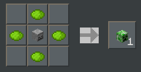
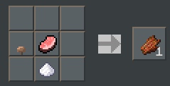
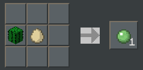
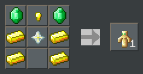
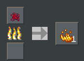
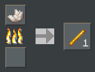
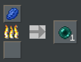
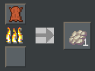

# No-Monster Datapack

A data pack for Minecrafters who like playing without monsters.

* [Recipes](#recipes)
  * [Crafting](#crafting)
  * [Smelting and Blasting](#smelting--blasting)
  * [Stonecutter](#stonecutter)
* [Drops](#drops)
  * [Animal Drops](#animal-drops)
  * [Block Drops](#block-drops)
  * [Fishing](#fishing)
* [Mob Control](#mob-control)

## Credits

Created by Jason C. McDonald (CodeMouse92).

Recipe screenshots and some .JSON files created on [https://crafting.thedestruc7i0n.ca/](https://crafting.thedestruc7i0n.ca/)

Some .JSON files created on [https://misode.github.io/](https://misode.github.io/).

Dedicated to Anne McDonald.

## Purpose

My mother, Anne, enjoys playing Minecraft with me, but she's never liked dealing with hostile mobs, so we usually turn those off. The trouble is, without monsters, there are so many important items you can never get! What's more, Peaceful mode just makes things *too* easy. (We want to be able to eat.)

This data pack fixes all that!

While I was at it, I decided to fix a bunch of things that commonly drive my mother nuts about Minecraft: animals drops are more realistic, carrots and potatoes can be found elsewhere, and several "missing" recipes are implemented.

## Features

* This data pack provides alternative sources for all hostile mob drops. Some are craftable or smeltable, others come from non-hostile mob drops.

* Adjusts the loot tables for animals to be more realistic.

* Removes hostile mobs on any difficulty level. (You can control which types of hostile mobs spawn.)

I highly recommend you also install my other data pack [The Missing Recipes](https://github.com/codemouse92/the-missing-recipes), which is designed as a companion to this one. Many recipes previously included in this datapack, but not actually directly to mob drops, have been moved to there.

## Nightmares: Temporarily Allowing Monsters

Recognizing that players may want combat in specific scenarios without allowing all monsters all the time,
I provided a way for you to temporarily enable monsters: Nightmares.

If _any_ player has the Bad Luck status effect, hostile mobs are allowed. Please take care in multiplayer, as the effects are global!

**If you really, _really_ don't want a type of monster to spawn, even during nightmares, enable the "never<Type>" rule
for the monster type. See Mob Control.

You can get the Bad Luck status effect from Nightmare Stew, a new recipe added
by this data pack.

See Recipes for the Nightmare Stew recipe.

> NOTE: Because the Bad Luck status effect is not applied by anything in vanilla Minecraft, this was a reasonably
> safe status effect to use. However, be aware if you're using any other data packs or command blocks that confer
> Bad Luck, as they will also allow monsters to spawn.

## Recipes

### Crafting

#### Creeper Head

4 lime dye around a skeleton skull produces a creeper head.



#### Dragon Breath

Crafted from 1 blaze powder (see Blast Furnace), 1 glowstone, 1 ghast tear,
and 1 sweet berries.


Okay, I'll admit, the only reason berries are included here is because my mother was asking if there was *anything* she could do with berries besides eat them. In any case, it adds to the initial difficulty of crafting.

#### Froglight

After much consideration, I decided not to override the Froglight recipes,
mainly because I can't think of any good frog-based ingredient that I could
use in a crafting recipe without making me a monster. Instead, I've moved
Magma Cubes and Slimes to their own mob group, so you can enable them
separately from everything else.

#### Gunpowder

Crafted from 1 coal or charcoal, 1 bonemeal, and 1 ghast tear.


In real life, gunpowder is made from charcoal, saltpeter, and sulfur.
I'm substituting ghast tears for saltpeter and bone meal for sulfur (although
that last one is a total scientific fabrication!)

### Music Discs

Crafted from 1 dye sandwiched between 2 phantom membrane. The type of dye
corresponds with the music disc.


The recipe for 11 is hidden (unless you cheat and read the code!)

It is not possible to craft Pigstep: these are very rare, and can only
be found in the world.

#### Nether Star

Crafted from 8 blaze powder (see Blast Furnace) and 1 diamond.


#### Nether Wart

Nether wart is now recoverable from nether wart blocks. One block yields nine
nether warts.


### Nightmare Stew

Nightmare Stew is a brand new item added to this mod pack that confers the Bad Luck status effect for 10 minutes
(half a day). When _any_ player has Bad Luck, all hostile mobs will be able to spawn as normal. As per usual,
you can clear this effect by drinking milk.

Craft by combining 1 wooden bowl, 1 red mushroom, 1 brown mushroom, and 1 poisonous potato.
(Hey, that stew would give _me_ nightmares!)


#### Rotten Flesh

Pork, beef, or mutton can be fermented into rotten flesh when combined with
1 sugar and 1 brown mushroom.



This recipe is based on that of a fermented spider eye.

#### Slimeball

Crafted from 1 kelp or cactus and 1 egg; yields 2 slimeballs.




This recipe is inspired by real life glue made from mucilage, of which
kelp and cactus are prime sources. I replaced the water typically used with
egg, which can also be used to make adhesive in real life.

#### String

Crafted from 1 white wool (yields 14 string) or 1 white carpet (yields 9 string).


Of course, making yarn in real life is never this easy...

#### Totem of Undying

Made from 4 gold ingots, 2 emeralds, 1 gold nugget, and 1 nether star.



I like to imagine that it's the nether star which absorbs the damage for the player.

#### Trident

Made from 3 prismarine crystals (see Blast Furnace), 4 prismarine shards,
and 2 blaze rods.


#### Zombie Head

8 rotten flesh around a skeleton skull produces a zombie head. Not sure why
you'd want this, but hey...here it is!


#### Wither Skeleton Skull

Made from 1 skeleton skull and 1 coal or charcoal.


#### White Carpet

Since 1 white carpet can yield 9 string (above), the inverse is true as well.


#### Wool

3 carpet atop each other yields 2 wool of the same color.


### Smelting & Blasting

To preserve some challenge of obtaining materials previously only available as hostile mob drops, I've chosen to require use of a blast furnace on most of these. Presumably, it's the high temperature that transforms the materials.

#### Blaze Powder

Blasting crimson roots yields blaze powder.



#### Blaze Rod

Blasting weeping vines yields a blaze rod.



#### Dragon Egg

The Dragon Egg has always been a coveted decor item, but now it has another use:
a way to gain a lot of experience very quickly!

Placing a Dragon Egg into a blast furnace yields...itself. (What can we say,
dragon eggs really like being warm!) But it also produces *400 experience* in
the process!


You're going to need a *lot* of fuel and time for this, however.

Don't worry about the dragon egg hatching, though — *that* takes thousands of
years. Just keep the egg warm, and you'll reap the benefits.

#### Ender Pearl

Smelting or blasting a warped wart block yields an ender pearl.



#### End Rod

Blasting a twisting vine yields an end rod.


This is intended as a logical complement to blasting a weeping vine into a blaze rod; an end rod is a "warping" of a blaze rod, one of its constituent ingredients.

#### Ghast Tear

Blasting warped roots yields a ghast tear.


#### Phantom Membrane

Blasting leather yields a phantom membrane.



#### Prismarine Crystal

Blasting a prismarine shard yields prismarine crystals.


I imagine this works because it refines the impurities out of the shard.

### Stonecutter

#### Skeleton Skull

You can carve a skeleton skull with a bone block on a stonecutter. (Added for my pal Scarecrowman.)


## Drops

### Animal Drops

Killing most animals now always yields bones and (if appropriate) meat. There is also a rare possibility of a skull being dropped. Larger animals drop more bones.

The amounts below are only without looting.

* Camel: 1-2 bones, 1-2 leather.
* Chicken: 1 raw chicken, 1-2 feathers.
* Cow: 2-3 raw beef, 1-2 bones, 1-2 leather.
* Donkey: 1-2 bones, 1-2 leather.
* Hoglin: 2-4 raw pork, 1-2 leather, 1-2 bones.
* Horse: 1-2 bones, 1-2 leather.
* Llama: 1-2 bones, 1-2 leather.
* Mooshroom: 2-3 raw beef, 1-2 bones, 1-2 leather,  1-2 red mushrooms.
* Mule: 1-2 bones, 1-2 leather.
* Pig: 1-2 raw pork, 1-2 bones.
* Rabbit: 1 raw rabbit, 1 rabbit hide.
* Sheep: 1-2 raw mutton, 1-2 bones.
* Skeleton Horse: 3-6 bones.
* Trader Llama: 1-2 bones, 1-2 leather, 1 blue carpet.

### Block Drops

Other wild plants might be hiding in the tall grass!

* Tall Grass -> Beetroot Seed
* Tall Grass -> Carrot
* Tall Grass -> Potato

In vanilla Minecraft, zombies are one of the only ways to get potatoes and carrots outside of finding them in a village. Since zombies are removed by this data pack, we needed another place to find these crops.

### Fishing

Several basic hostile mob drops have been added as junk or treasure from fishing, or else the probability of finding it has been increased.

* Bones (junk)
* Prismarine Shard (treasure)
* Rotten Flesh (junk)
* Spider Eye (junk)
* Wet Sponge (treasure)

Lilypads are now also junk from fishing in swamps, and their likelihood as treasure is more rare. Crafted junk is also rarer.

## Mob Control

The spawning of potentially hostile mobs are controlled by the datapack. Certain groups of mobs can be allowed or suppressed. By default, none of these groups are allowed to spawn.

Most mobs are actually removed from the world altogether, instead of being killed in place, to eliminate drops. The only exceptions to this are the ender dragon, to facilitate escape from the end, and the wither, to provide another source for nether stars.

There are three control levels for each mob type:

**Allow** permits the mob group to spawn normally. To allow a group, run `/function no-monster:control/allow/<group>`.

**Suppress** prevents the mob group from spawning, except during nightmares. This is the default behavior. To suppress a group, run `/function no-monster:control/suppress/<group>`.

**Block** prevents the mob group from spawning, even during nightmares. To block a group, run `/function no-monster:control/never/<group>`.

> NOTE: The `spawn` game rules from previous versions of No Monster Minecraft still work, but you no longer need to set them directly!

For example, to enable Illagers, use:

```
/function no-monster:control/allow/illagers
```

To suppress Illagers again, run:

```
/function no-monster:control/suppress/illagers
```

To ensure Illagers can NEVER spawn, even during nightmares, run:

```
/function no-monster:control/block/illagers
```

### Illagers

These are the evil villager types.

* Evokers
* Illusioners
* Pillagers
* Ravagers
* Vexes
* Vindicators
* Witches

Control with one of these three commands

```
/function no-monster:control/allow/illagers
/function no-monster:control/suppress/illagers
/function no-monster:control/block/illagers
```

Remember, you can also disable only raids using Minecraft's built-in `disableRaids` gamerule.

### Arthropods

These are hostile overworld arthropods.

* Cave Spiders
* Silverfish
* Spiders

Control with one of these three commands

```
/function no-monster:control/allow/arthropods
/function no-monster:control/suppress/arthropods
/function no-monster:control/block/arthropods
```

### Creepers

Creepers are controlled separately, for those who don't like their stuff
getting blown to pieces...or perhaps do, but dislike other monsters.

* Creepers

Control with one of these three commands

```
/function no-monster:control/allow/creepers
/function no-monster:control/suppress/creepers
/function no-monster:control/block/creepers
```

### Slimes

These are slime-type mobs.

* Slimes
* Magma Cubes

Control with one of these three commands

```
/function no-monster:control/allow/slimes
/function no-monster:control/suppress/slimes
/function no-monster:control/block/slimes
```

### Undead

These are undead overworld hostile mobs.

* Drowned
* Husks
* Phantom
* Skeletons
* Strays
* Zombies
* Zombie Villagers

Control with one of these three commands

```
/function no-monster:control/allow/undead
/function no-monster:control/suppress/undead
/function no-monster:control/block/undead
```

> **Note:** The old `spawnMonster` rule no longer works; the Monsters category
> has been split into Undead and Slimes.

### Guardians

These are controlled separately, since guardian spawning is limited to ocean
monuments, and thus may still be wanted.

* Elder Guardians
* Guardians

Control with one of these three commands

```
/function no-monster:control/allow/guardians
/function no-monster:control/suppress/guardians
/function no-monster:control/block/guardians
```

### Nether Mobs

These are non-monster nether mobs; there are safe ways of interacting with
these.

* Piglins
* Zombified Piglins

Control with one of these three commands

```
/function no-monster:control/allow/nether_mobs
/function no-monster:control/suppress/nether_mobs
/function no-monster:control/block/nether_mobs
```

### Nether Hostiles

These are hostile nether mobs that don't quite classify as monsters.

* Hoglins
* Piglin Brutes

Control with one of these three commands

```
/function no-monster:control/allow/nether_hostiles
/function no-monster:control/suppress/nether_hostiles
/function no-monster:control/block/nether_hostiles
```

### Nether Monsters

These are most of the monster-like hostile mobs in the nether.

* Blazes
* Ghasts
* Wither Skeletons

Control with one of these three commands

```
/function no-monster:control/allow/nether_monsters
/function no-monster:control/suppress/nether_monsters
/function no-monster:control/block/nether_monsters
```

> **Note:** Magma Cubes are now controlled with `spawnSlimes`, due to their
> desirability in relation to overworld frogs in 1.19 and beyond.

### End Mobs

These are non-monster mobs in the End; these are safe ways of interacting with
these.

* Endermen

Control with one of these three commands

```
/function no-monster:control/allow/end_mobs
/function no-monster:control/suppress/end_mobs
/function no-monster:control/block/end_mobs
```

### End Monsters

These are monster-like hostile mobs in the End. Shulkers themselves are *always*
allowed to spawn, but eliminating the shulker bullets removes their means
of hostility.

* Endermites
* Shulker bullets

Control with one of these three commands

```
/function no-monster:control/allow/end_monsters
/function no-monster:control/suppress/end_monsters
/function no-monster:control/block/end_monsters
```

## Bosses

Because all items necessary to spawn bosses are accessible without other
hostile mobs being enabled, these can be controlled separately as well.

* Ender Dragon
* Wither

Dragons are automatically killed upon spawning, so they still drop their
loot and produce a portal. Withers are removed so they don't spawn cheap
nether stars - use the added recipe instead.

Wardens are not included in this group. See "Non-Controlled Mobs".

Control with one of these three commands

```
/function no-monster:control/allow/bosses
/function no-monster:control/suppress/bosses
/function no-monster:control/block/bosses
```

### Non-Controlled Mobs

One of the reasons for the datapack is the assumption that *some* challenge is
desired. Just for reference, the following mobs are potentially dangerous to
the player, but are not affected by this datapack:

* Bees
* Dolphins
* Goats
* Iron Golems
* Llamas
* Pandas
* Polar Bears
* Pufferfish
* Shulkers (excluding bullets)
* Trader Llamas
* Warden (see note below)
* Wolves

All passive mobs are also unaffected.

#### Why Not Wardens?

There are a few reasons I've decided not to control the Warden with this
data pack:

1. It can already be controlled with the `doWardenSpawning` gamerule.

2. Removing Wardens makes the Deep Dark and Ancient Cities quite a lot
   less interesting.

3. They have no drops, because you're supposed to be avoiding them anyway.

## Other Functions

The functions under `no-monster/internals` are only intended to be used by the mod itself.
Using them yourself may have unintended consequences...including, potentially, killing yourself.
Don't use these. Just don't.
